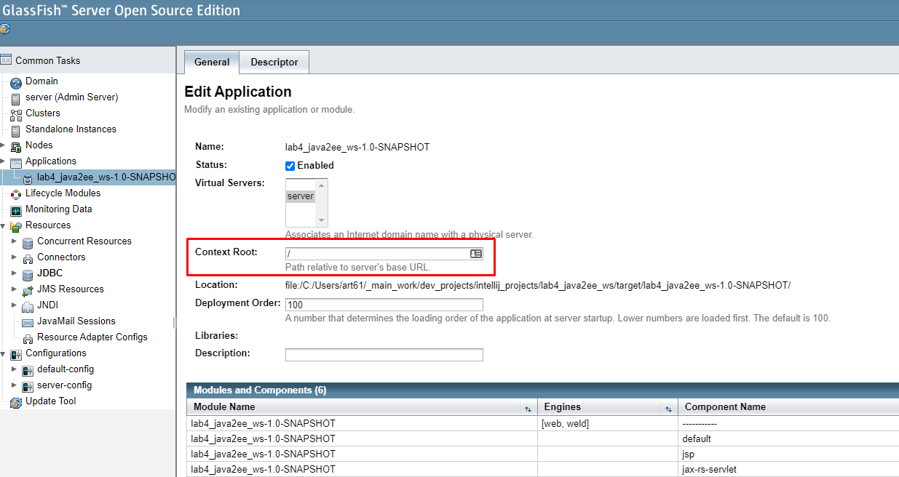
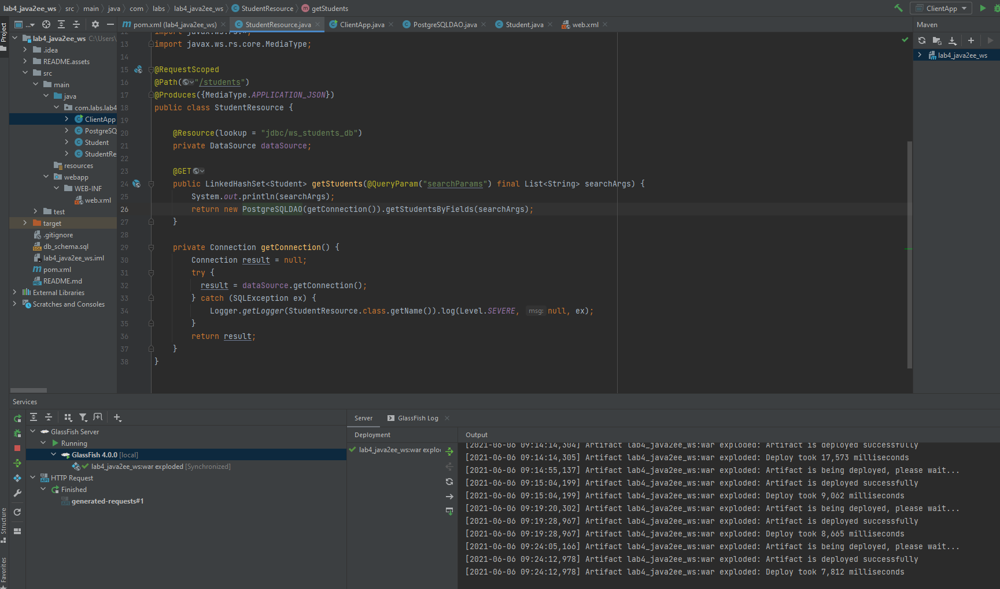
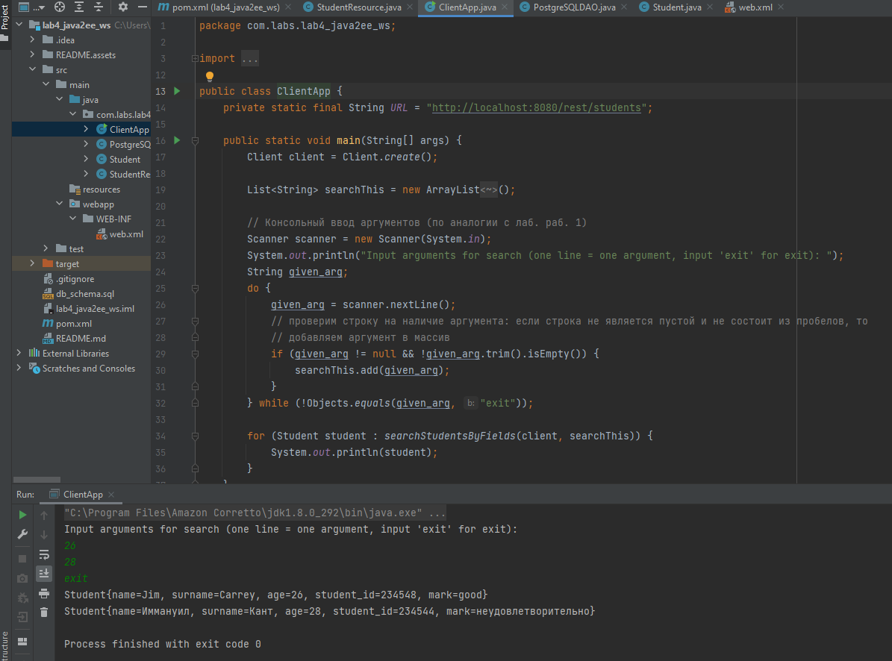

**Лабораторная работа 4. Часть 2. Реализация java2ee-сервиса**

# Поиск с помощью java2ee-реализации REST-сервиса

## Задание

> Таблица БД, а также код для работы с ней был взят из предыдущих работ без изменений. Внедрение источника данных также взято из 1 лабораторной работы.

Выполнить задание из лабораторной работы 1, но с использованием REST-сервиса:

1. Реализовать возможность поиска по любым комбинациям полей с помощью REST-сервиса. 
2. Данные для поиска должны передаваться в метод сервиса в качестве аргументов.
3. Веб-сервис реализовать в виде java2ee-приложения. 
4. При реализации в виде J2EE-приложения следует на стороне сервера приложений настроить источник данных, и осуществлять его иньекцию в коде сервиса (см. Лабораторная работа 1, часть 2).
5. Для демонстрации сервисов следует также разработать клиентское консольное приложение (см. Лабораторная работа 4, часть 1).

## Ход работы

За основу возьмем подготовленный в предыдущих работах код и базу данных. 

В pom.xml добавляем:

```xml
<?xml version="1.0" encoding="UTF-8"?>
<project xmlns="http://maven.apache.org/POM/4.0.0"
         xmlns:xsi="http://www.w3.org/2001/XMLSchema-instance"
         xsi:schemaLocation="http://maven.apache.org/POM/4.0.0 https://maven.apache.org/xsd/maven-4.0.0.xsd">
    <modelVersion>4.0.0</modelVersion>

    <groupId>com.labs</groupId>
    <artifactId>lab4_java2ee_ws</artifactId>
    <version>1.0-SNAPSHOT</version>
    <name>lab4_java2ee_ws</name>
    <packaging>war</packaging>

    <properties>
        <maven.compiler.target>1.8</maven.compiler.target>
        <maven.compiler.source>1.8</maven.compiler.source>
    </properties>

    <dependencies>
        <dependency>
            <groupId>javax</groupId>
            <artifactId>javaee-web-api</artifactId>
            <version>8.0.1</version>
            <scope>provided</scope>
        </dependency>
        <dependency>
            <groupId>com.sun.jersey</groupId>
            <artifactId>jersey-server</artifactId>
            <version>1.19.4</version>
        </dependency>
        <dependency>
            <groupId>com.sun.jersey</groupId>
            <artifactId>jersey-servlet</artifactId>
            <version>1.19.4</version>
        </dependency>
        <dependency>
            <groupId>com.sun.jersey</groupId>
            <artifactId>jersey-grizzly2</artifactId>
            <version>1.19.4</version>
        </dependency>
        <dependency>
            <groupId>com.sun.jersey</groupId>
            <artifactId>jersey-json</artifactId>
            <version>1.19.4</version>
        </dependency>
        <dependency>
            <groupId>com.sun.jersey</groupId>
            <artifactId>jersey-client</artifactId>
            <version>1.19.4</version>
        </dependency>
    </dependencies>

    <build>
        <plugins>
            <plugin>
                <groupId>org.apache.maven.plugins</groupId>
                <artifactId>maven-war-plugin</artifactId>
                <version>3.3.1</version>
            </plugin>
        </plugins>
    </build>
</project>
```


В web.xml добавляем:

```xml
<?xml version="1.0" encoding="UTF-8"?>
<web-app xmlns="http://xmlns.jcp.org/xml/ns/javaee"
         xmlns:xsi="http://www.w3.org/2001/XMLSchema-instance"
         xsi:schemaLocation="http://xmlns.jcp.org/xml/ns/javaee http://xmlns.jcp.org/xml/ns/javaee/web-app_4_0.xsd"
         version="4.0">
    <servlet>
        <servlet-name>jax-rs-servlet</servlet-name>
        <servlet-class>com.sun.jersey.spi.container.servlet.ServletContainer</servlet-class>
        <init-param>
            <param-name>com.sun.jersey.config.property.packages</param-name>
            <param-value>com.labs.lab4_java2ee_ws</param-value>
        </init-param>
        <load-on-startup>1</load-on-startup>
    </servlet>

    <servlet-mapping>
        <servlet-name>jax-rs-servlet</servlet-name>
        <url-pattern>/rest/*</url-pattern>
    </servlet-mapping>
</web-app>
```

Класс App в данном случае нам не понадобится. 

В итоге остается только три класса (не считая клиента): PostgreSQLDAO, Student, StudentResource. Иньекция источника данных в коде производится в классе StudentResource в виде:

```java
@Resource(lookup = "jdbc/ws_students_db")
private DataSource dataSource;
```

В настройках в консоли администрирования сервера приложений Glassfish по адресу `localhost:4848` (при установке с портами по умолчанию) необходимо для приложения указать `Context Root: /`.



Это определит возможность обращения к сервису через корневой адрес, например, так:

```http
http://localhost:8080/rest/students?searchParams=26&searchParams=28
```

Пример полученного ответа в JSON:

```json
{"student":[{"age":"26","mark":"good","name":"Jim","student_id":"234548","surname":"Carrey"},{"age":"28","mark":"неудовлетворительно","name":"Иммануил","student_id":"234544","surname":"Кант"}]}
```

Дальнейшая реализация не имеет особых различий с предыдущими лабораторными работами, особенно первой и четвертой. 



Реализация клиентского приложения была произведена в первой части работы, поэтому в данном случае мы просто скопируем класс ClientApp.



